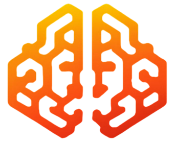

# MemoSui メ

<p align="center">
  
</p>

**MemoSui** 是一个去中心化 AI 记忆保险库——由 Google Gemini AI 驱动，基于 Sui 区块链和 Walrus 协议保障安全的个人知识账本。

**MemoSui** is a decentralized AI memory vault — a personal knowledge ledger powered by Google Gemini AI, secured on the Sui blockchain and Walrus Protocol.

---

写下你的想法、回忆或技术日志。MemoSui 的 AI 会总结并索引每一条记录，然后在 Sui 网络上提交不可篡改的指纹，同时将加密数据分片存储到 Walrus 去中心化存储节点。

Write your thoughts, memories, or technical logs. MemoSui's AI summarizes and indexes each entry, then commits an immutable fingerprint to the Sui network while sharding the encrypted payload across Walrus decentralized storage nodes.

---

## 功能 / Features

| 功能 | Feature |
|------|---------|
| **AI 智能索引** — Gemini Flash 将原始文本总结为结构化条目，包含标签、行动项和重要度评分 | **AI-Powered Indexing** — Gemini Flash summarizes raw text into structured entries with tags, action items, and importance ratings |
| **链上指纹** — 每条记忆生成 SHA-256 内容哈希，作为可验证的 Sui 交易提交 | **On-Chain Fingerprints** — Each memory gets a SHA-256 content hash committed as a verifiable Sui transaction |
| **Walrus 分片存储** — 数据纠删编码为 16 个分片，分布到去中心化存储节点（支持真实 SDK 或模拟沙盒） | **Walrus Storage Shards** — Payloads are erasure-encoded into 16 shards, distributed across decentralized storage nodes (real SDK or simulated sandbox) |
| **对话式记忆聊天机器人** — 基于 RAG 的对话代理，可查询你的个人记忆库 | **Conversational Memory ChatBot** — RAG-powered chat that queries your personal memory vault |
| **记忆知识图谱** — 可视化记忆之间的关联和模式 | **Memory Knowledge Graph** — Visualize connections and patterns across your memory blocks |
| **时间线与验证** — 浏览记忆历史，在链上验证密码学完整性证明 | **Timeline & Verification** — Browse your memory history and verify cryptographic integrity proofs on-chain |
| **数字永生** — 自主数字资产许可和遗产规划 | **Digital Immortality** — Sovereign digital asset licensing and legacy planning |
| **双语界面** — 完整的中文/英文界面，运行时切换 | **Bilingual UI** — Full Chinese/English interface with runtime language switching |
| **钱包集成** — MetaMask 和 Sui (OKX) 钱包支持，实时余额同步 | **Wallet Integration** — MetaMask and Sui (OKX/Preset) wallet support with real-time balance sync |

---

## 技术栈 / Tech Stack

| 层级 Layer | 技术 Technology |
|------------|----------------|
| 前端 Frontend | React 19, TypeScript, Vite, Tailwind CSS, Recharts, Motion |
| 后端 Backend | Express (Node.js), tsx dev server |
| AI | Google Gemini 3.5 Flash (`@google/genai`) |
| 区块链 Blockchain | Sui Network — Move 智能合约, Sui JSON-RPC |
| 存储 Storage | Walrus Protocol via MemWal SDK (`@mysten-incubation/memwal`) |
| 图标 Icons | Lucide React |

---

## 项目结构 / Project Structure

```
src/
├── App.tsx                          # 根组件，路由和状态管理 / Root component, routing, state
├── main.tsx                         # React 入口 / React entry point
├── types.ts                         # TypeScript 类型定义 / Type definitions
├── utils.ts                         # 哈希模拟、工具函数 / Hash simulation, helpers
├── locales.ts                       # 中英文翻译 / Chinese/English translations
├── index.css                        # 全局样式 / Global styles (Tailwind + custom)
└── components/
    ├── NetworkHeader.tsx            # 顶栏：网络状态、钱包、语言/主题切换
    ├── WalletLoginGateway.tsx       # 钱包连接页面 / Wallet connection screen
    ├── CreateMemoryForm.tsx         # 记忆输入表单 + AI 摘要流水线 / Memory input + AI pipeline
    ├── MemoryTimeline.tsx           # 记忆时间线列表 / Scrollable memory feed
    ├── MemoryChatBot.tsx            # 记忆库 RAG 聊天代理 / RAG chat over memory vault
    ├── MemoryResearcher.tsx         # 深度模式分析 / Deep pattern analysis
    ├── MemoryKnowledgeGraph.tsx     # 交互式知识图谱 / Knowledge visualization
    ├── StorageNodeMap.tsx           # Walrus 存储节点拓扑图 / Node topology map
    ├── VerificationTab.tsx          # 多模式哈希验证工具 / Multi-mode hash verification
    ├── VerifyModal.tsx              # 单条密码学证明检查器 / Per-memory proof inspector
    ├── DigitalImmortalityTab.tsx    # 数字遗产和资产许可 / Digital legacy & licensing
    ├── SettingsTab.tsx              # 钱包配置、SDK 参数、数据清除 / Config & data wipe
    └── MemoSuiLogo.tsx              # Logo 组件 / Logo component
server.ts                            # Express 服务端 / API server
```

---

## 快速开始 / Getting Started

**前置要求 / Prerequisites:** Node.js 18+

```bash
npm install
```

参考 `.env.example` 创建 `.env` 文件：

```env
GEMINI_API_KEY="your-gemini-api-key"
```

启动开发服务器：

```bash
npm run dev
```

应用运行在 `http://localhost:3000`。

### 生产构建 / Production Build

```bash
npm run build
npm start
```

---

## 工作原理 / How It Works

1. **输入 / Input** — 在 Noter 中写入记忆（文字、想法、日记、技术日志）
2. **AI 索引 / AI Indexing** — Gemini Flash 提取标题、摘要、标签、行动项和重要度评分
3. **哈希与签名 / Hash & Sign** — 生成 SHA-256 指纹；可选通过 MetaMask `personal_sign` 签名
4. **Walrus 存储 / Walrus Storage** — 数据纠删编码为 16 个分片，分布到去中心化存储节点
5. **Sui 上链 / Sui Commitment** — 元数据和 Blob 指针提交至 Sui 账本，成为不可篡改区块
6. **验证 / Verify** — 任意条目均可通过其密码学证明在链上进行验证

---

## MemWal SDK 集成 / MemWal SDK Integration

MemoSui 集成了真实 MemWal SDK (`@mysten-incubation/memwal`) 用于连接 Walrus 存储。在设置面板中可在模拟沙盒模式和真实 SDK 模式之间切换。真实 SDK 模式需要：

- 有效的 MemWal 委托密钥和账户 ID
- 中继节点 URL（默认: `https://relayer.staging.memwal.ai`）
- Sui 测试网/主网余额用于支付 Gas

MemoSui integrates with the real MemWal SDK for live Walrus storage. Toggle between simulated sandbox and real SDK mode in Settings. Real SDK mode requires: a valid MemWal delegate key and account ID, relayer URL, and Sui testnet/mainnet balance for gas.

---

## API 端点 / API Endpoints

| 端点 Endpoint | 描述 Description |
|---------------|------------------|
| `POST /api/summarize` | AI 记忆分析与索引 / AI-powered memory analysis and indexing |
| `POST /api/chat` | 记忆库 RAG 对话代理 / RAG chat agent over user's memory vault |
| `POST /api/memwal/remember` | 通过 MemWal SDK 写入 Walrus 存储 / Real Walrus storage via MemWal SDK |

---

## 许可证 / License

Apache-2.0
